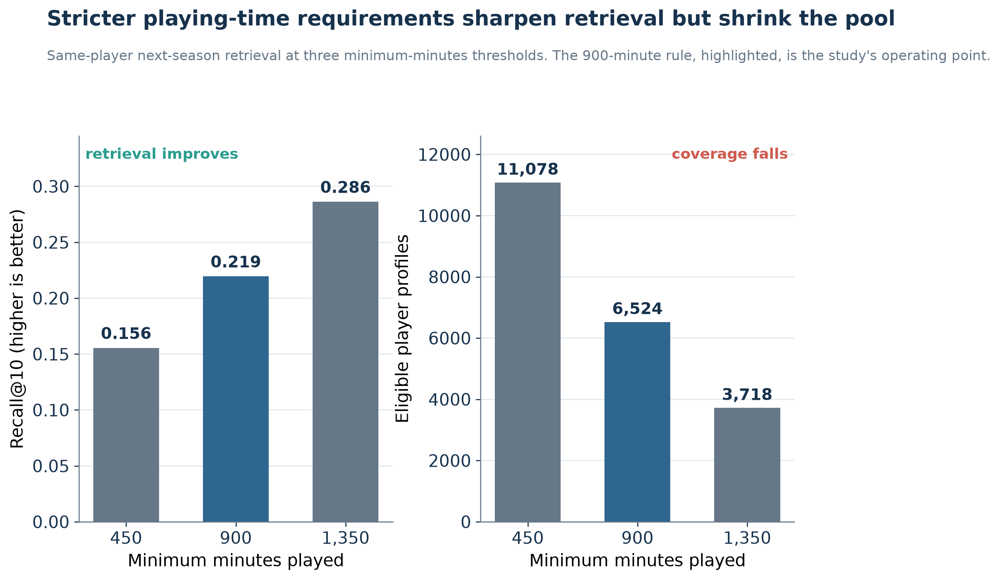
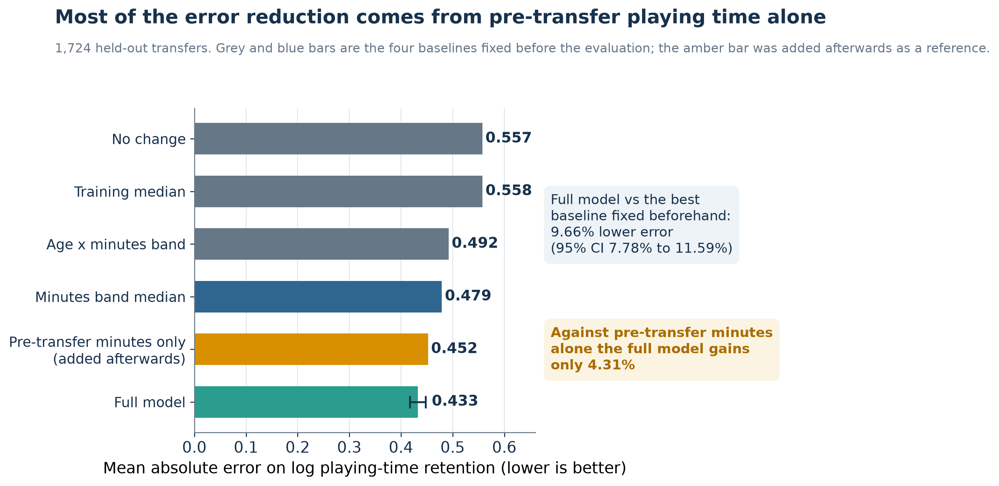

# Beyond Like-for-Like: Linking Player Similarity with Post-Transfer Playing-Time Retention

Football recruitment involves at least two separate uncertainties. A club has to find players whose
observable behaviour resembles a target profile, and it has to judge whether a candidate is likely
to keep playing once he moves. This study evaluates those questions **separately**, on
chronologically held-out football data, and reports where each signal holds and where it breaks
down.

The two questions are deliberately never merged into a single recruitment score. Stylistic
resemblance and post-move retention describe different things, rest on different evidence, and fail
in different places — averaging them would produce a confident-looking number exactly where both
components are least reliable.

---

## The recruitment problem

A scouting department starts from a target profile and needs a defensible way to widen the search
beyond reputation and price. A cheaper player may resemble an expensive target in observed actions
without being an equivalent replacement. Separately, once a candidate is shortlisted, the club has
to form a view on whether he will actually play after the move — which depends on opportunity, role,
fitness, squad competition and manager preference as much as on ability.

These are different problems. This repository keeps them apart.

| | **Module A — player similarity** | **Module B — playing-time retention** |
| --- | --- | --- |
| Unit of analysis | one player, one club, one competition, one season | one dated transfer event |
| Question | which profiles resemble this one | how much playing time is likely to be retained |
| Target | same-player next-season retrieval | log ratio of post- to pre-transfer minutes |
| Evaluation | Recall@10 against a position-matched pool | mean absolute error against pre-set baselines |
| What it is **not** | proof of interchangeability | a prediction of transfer success |

---

## Study design

Both modules use chronological partitions with a single held-out evaluation opened once.

**Module A** represents each player-club-competition-season through 32 per-90 behavioural features
covering passing, progression, creation, carrying, shooting, defending and recoveries. Features are
log-transformed and robustly scaled within competition; candidates are position-matched, and
goalkeepers are compared only with goalkeepers using their own nine features. Ranking uses
equal-feature Manhattan distance. Eligibility requires at least 900 minutes played, a known
position, and adequate feature coverage.

**Module B** treats each transfer as a dated event with 365-day windows on either side and at least
450 minutes in each. It predicts the log ratio of post- to pre-transfer minutes from pre-transfer
information only. Ordinary least squares is fitted on chronologically earlier, player-disjoint
transfers and compared against four baselines fixed before the evaluation.

---

## What the similarity evaluation actually measures

There is no expert-labelled set of equivalent players to score against. The evaluation therefore
asks a narrower question: does a player's next-season profile retrieve **his own** previous-season
profile within the top ten of a position-matched pool?

This is a **temporal self-consistency proxy**. It tests whether a behavioural fingerprint is stable
enough to be found again a season later — a necessary condition for meaningful retrieval, but not a
sufficient one. It is explicitly **not** evidence of player interchangeability, tactical fit,
transfer success, or any causal relationship.

---

## Headline held-out results

| Module | Held-out sample | Headline result | Reference point |
| --- | --- | --- | --- |
| A — similarity | 6,524 queries | Recall@10 **0.219** (95% CI 0.209–0.229) | ≈0.2% by chance in a median pool of 5,884 candidates |
| B — retention | 1,724 transfers | MAE **0.433** (95% CI 0.417–0.448), Spearman 0.638 | **9.66%** lower error (95% CI 7.8–11.6%) than the strongest pre-set baseline at 0.479 |

Retrieval is well above chance, and the retention model improves on every baseline that was fixed in
advance. Both results carry important qualifications, set out below.

---

## Player similarity under different evidence thresholds



How much football has been observed governs how well a profile can be matched. Raising the minimum
playing-time requirement from 450 to 900 to 1,350 minutes lifts Recall@10 from 0.156 to 0.219 to
0.286, while the number of eligible player profiles falls from 11,078 to 6,524 to 3,718. Sharper
matching and wider coverage pull in opposite directions, and the threshold a club chooses prices
that trade-off directly. The 900-minute rule is this study's operating point.

### Context sensitivity

Retrieval depends heavily on what changed between seasons.

| Context | Queries | Recall@10 | Median rank |
| --- | --- | --- | --- |
| Same club, same competition | 3,617 | 0.305 | 50 |
| Same club, different competition | 498 | 0.165 | 249 |
| Different club, same competition | 1,206 | 0.139 | 173 |
| **Different club, different competition** | **1,203** | **0.066** | **496** |

The last row is closest to the situation recruitment actually faces, and it is the weakest measured.
Goalkeepers reach 0.099 against 0.237 for outfield players, which reflects the sparse goalkeeping
feature set rather than a claim about goalkeepers themselves.

---

## Post-transfer playing-time retention



Across 1,724 held-out transfers the full model records MAE 0.433 against 0.479 for the strongest
baseline fixed beforehand, a 9.66% reduction whose player-clustered interval (7.8–11.6%) excludes
zero. The improvement is real, and it is also bounded: a reference added afterwards that uses prior
playing time alone already reaches 0.452, leaving a further 4.3% attributable to the richer feature
set. Pre-transfer exposure appears in the denominator of the target, so part of the apparent skill
is regression to the mean rather than football-specific information.

Error rises 6.9% from validation to the held-out set, mean bias is +0.141, and 19 of the 20 largest
misses are sharp playing-time declines that the model over-predicts — the case a recruitment
department would most want flagged is the one it most reliably misses.

---

## How a recruitment department could use this

1. A club specifies a target profile.
2. The similarity module returns a ranked, position-matched shortlist for scouts to interrogate —
   displaying the context-appropriate retrieval rate, not the headline figure, since a shortlist is
   by definition a cross-club and usually cross-competition question.
3. The retention module separately attaches a playing-time estimate to a specific move, with its
   interval and its known blind spot on sharp declines shown alongside.
4. Tactical, medical, contractual, financial and squad-planning judgement remains with people.

Neither module produces a signing recommendation, and the two are not combined into one ranking.

---

## Repository contents

```
.
├── assets/                     researcher and collaboration images
├── docs/
│   ├── data_provenance.md      sources, licensing and what is not redistributed
│   ├── limitations.md          full limitation register
│   ├── methodology.md          feature, distance, target and evaluation definitions
│   └── reproducibility.md      what can and cannot be reproduced here
├── figures/                    both paper figures, PNG and SVG
├── paper/                      the submitted paper
├── results/                    small aggregate result tables
├── scripts/verify_release.py   release and consistency checks
└── src/
    ├── build_figures.py        regenerates both figures from results/
    ├── core_definitions.py     per-90 rates, scaling, distance, retention target
    ├── retention_baselines.py  the four pre-set baselines
    └── similarity_distance.py  feature families, eligibility, robust normalizer
```

---

## Reproducing what is here

**Reproducibility status: PARTIAL.** Figures and published metrics can be regenerated and checked
from this repository. Re-estimating the models cannot, because the underlying player and transfer
records are not redistributable — see [`docs/data_provenance.md`](docs/data_provenance.md).

```bash
python -m venv .venv
source .venv/bin/activate
python -m pip install -r requirements.txt

python src/build_figures.py        # regenerate both figures from results/
python scripts/verify_release.py   # release checks and metric verification
```

`src/build_figures.py` reads only `results/*.csv`, so both figures reproduce exactly on any machine.
`scripts/verify_release.py` checks the published numbers against the paper's stated values and runs
the release-safety checks. Full model re-estimation requires authorized access to the source data
and is not possible from this repository alone. See
[`docs/reproducibility.md`](docs/reproducibility.md) for the distinction between figure
reproduction, metric verification and full model reproduction.

---

## Data availability

The analysis draws on Transfermarkt-derived transfer and appearance data obtained through the
`dcaribou/transfermarkt-datasets` project, together with an internal SoccerSolver match and
player-season export. **No raw or derived row-level data is published here.** The upstream
repository declares CC0-1.0, but the underlying Transfermarkt rights position is unresolved, and the
SoccerSolver export carries no redistribution licence. Only small aggregate result tables are
included. Full detail, including how an authorized researcher would reconstruct the pipeline, is in
[`docs/data_provenance.md`](docs/data_provenance.md).

---

## Limitations

- Same-player next-season retrieval is a temporal consistency proxy, not expert-labelled player
  equivalence, and carries no claim of interchangeability.
- Retrieval is weakest under exactly the club and competition changes recruitment involves
  (Recall@10 0.066).
- Goalkeeper retrieval is limited by a sparse specialist feature set.
- Retrieval magnitude depends on the minimum-minutes rule, so the headline is partly a property of
  the eligibility choice.
- Playing-time retention is an opportunity measure, not player quality, tactical fit or transfer
  success.
- Pre-transfer exposure sits inside the retention target, so part of the model's apparent skill is
  regression to the mean.
- Retention error and positive bias both grow from validation to the held-out set, and sharp
  declines are systematically over-predicted.
- All reported associations are predictive and descriptive. No causal destination, club, league,
  age, fee or transfer-type effect is identified.
- Competition coverage is broad but is not a defined sampling frame, so generalization beyond the
  observed competitions is not supported.

The complete register is in [`docs/limitations.md`](docs/limitations.md).

---

## Citation

Metadata is in [`CITATION.cff`](CITATION.cff). Rupayan Halder is a confirmed researcher and author
of this project; the complete author list is still being finalized and no claim of sole authorship
is made. No DOI, paper identifier or acceptance status is asserted.

---

## Researcher

<p align="left">
  
</p>

### Rupayan Halder

**PhD Student**
Jadavpur University, Kolkata

**Football AI Researcher**

**Assistant Professor**
University of Engineering & Management (UEM), Kolkata

**Research Collaborator**
SoccerSolver

**Former Software Engineer — Platform Engineering**
Session AI

Rupayan's research interests focus on applying artificial intelligence, machine learning, data
analytics, and computational methods to real-world problems in football, including player
performance analysis, recruitment, transfer-market decision-making, and sporting strategy.

### Connect

[GitHub](https://github.com/RupayanHalder39) ·
[LinkedIn](https://www.linkedin.com/in/rupayan-halder-962922209/) ·
[Email](mailto:rupayanhalder313239@gmail.com)

---

## Research Collaboration

<p align="left">
  
</p>

This research was developed in collaboration with SoccerSolver. SoccerSolver currently works with
more than 10 football clubs.

---

## Licence

The repository software is provided under the MIT License. This does not grant rights to the
underlying Transfermarkt-derived or SoccerSolver data, to the paper text, or to any provider names,
marks or images. Data access and redistribution remain subject to separate authorization; see
[`PUBLIC_RELEASE_AUDIT.md`](PUBLIC_RELEASE_AUDIT.md) and [`LICENSE`](LICENSE).
